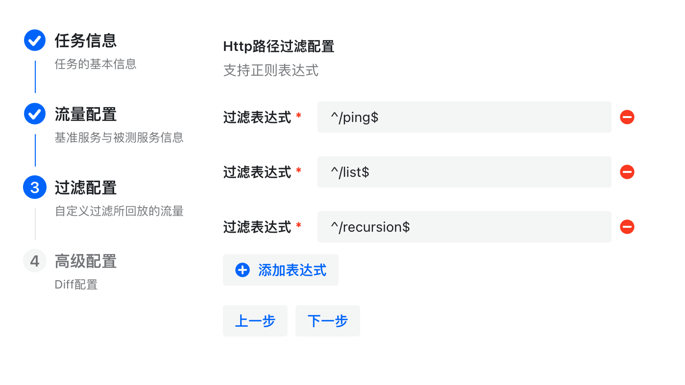
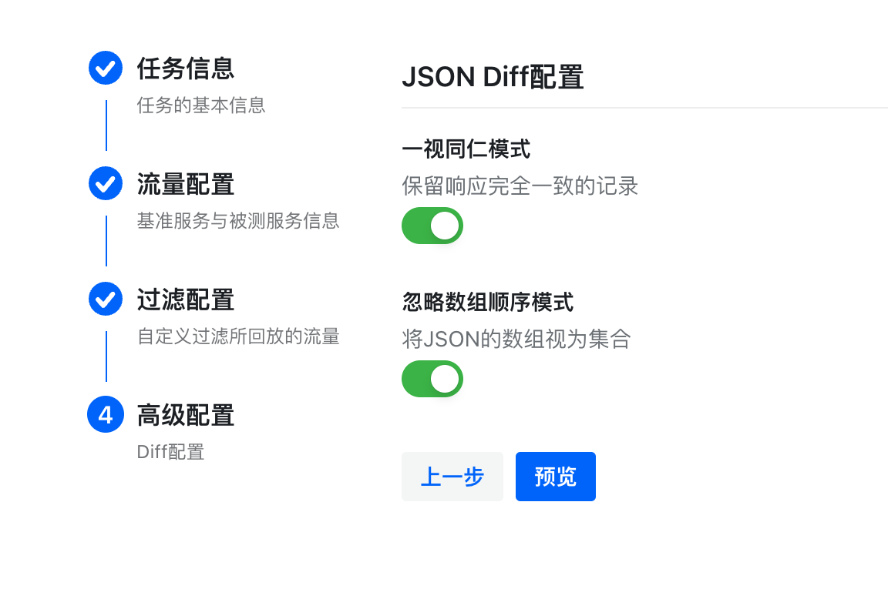

# BubbleDiff

> 随着微服务架构的兴起，服务之间的依赖关系变的越来越复杂，软件测试也面临新的挑战：系统升级频繁、服务依赖众多等等。常见的测试方案（如：单元测试、系统测试等）构造和维护测试用例成本高，特别是业务复杂的场景，构造测试数据难。为此，我们需要开发一套流量重放系统BubbleDiff来缓解上述问题。
>
> BubbleDiff适用于HTTP/1.1协议的Web服务，HTTP是一种基于TCP传输层，能够获取如HTML这样的网络资源的通讯协议。它是在 Web 上进行数据交换的基础，是一种client-server协议，也就是说，请求通常是由像浏览器这样的接受方发起的。一个完整的Web文档通常是由不同的子文档拼接而成的，像是文本、布局描述、图片、视频、脚本等等。目前业界主流的业务系统,如广告ToB系统、大数据管理平台等系统都是HTTP服务。熟悉HTTP应用层通信协议对实现流量重放系统有很重要的意义,虽然每种应用层协议各不相同,但对于TCP流处理思想是相似的,可以扩展到其他协议，如Thrift的二进制协议，甚至到MySQL/Redis通信协议，也可以配合对应方法解析完成对流量的重放处理。

## 如何使用平台

### 创建Diff任务

为了使`Diff`可管理化，我们将一次回放测试抽象成`Diff`任务。创建一个Diff任务，总共需要填写四个表格信息。

1. 任务概要信息
2. 流量靶向信息
3. 流量过滤配置
4. 高级`Diff`配置

我们通过点击平台上的创建Diff任务，即可进入表单。

> :exclamation:需要登录才能创建Diff任务。

<div style="display:flex;justify-content:center">
  
</div>


接下来，进入任务概要信息表单。我们需要明确这个Diff任务所要完成的工作，测试的目标。

> :exclamation:任务名不能重复。

<div style="display:flex;justify-content:center">
  
</div>


点击下一步，如信息符合校验，进入流量靶向信息表单。我们需要明确这个Diff任务的线上服务以及被测服务的网络信息。比如线上服务流量所经网卡，监听端口和被测服务IP地址。在本示例中，监听网卡设置为`lo0`，因为我们的线上服务和被测服务均部署于Mac本地，且请求也从本地发出，因此流量只经过本地网卡。

> :bulb:一般地，企业的HTTP服务部署在Docker中，我们只需监听`eth0`端口即可。

<div style="display:flex;justify-content:center">
  
</div>


点击下一步，进入流量过滤配置表单。在这里，我们可以通过正则表达式，只对符合条件的接口进行抓包。

<div style="display:flex;justify-content:center">
  
</div>


最后，进入高级Diff配置表单。这里，我们可以针对性地对Diff结果等进行进阶配置。

<div style="display:flex;justify-content:center">
  
</div>


> :bulb:忽略数组顺序模式，其实是将JSON里的数组视作集合看待。比如，没开启忽略数组顺模式时，结果将会是这样：
>
> <div style="display:flex;justify-content:center">
>   
> </div>
>
> 然而，开启该模式后：
>
> <div style="display:flex;justify-content:center">
>   
> </div>

点击下一步，进入到预览界面，在这里可以确认自己填写的信息是否准确。

<div style="display:flex;justify-content:center">
  
</div>


确认无误后，点击提交，即可创建任务。创建成功后，跳转到任务的主界面。如图所示，这里可以进行Diff的启停和结果展示。

<div style="display:flex;justify-content:center">
  
</div>


### 部署BubbleCopy

接下来，为了能够转发流量，我们需要将`BubbleCopy`部署至你的线上服务实例上。目前，`BubbleCopy`在`GitHub Release`上仅提供`MacOS`平台的预编译产物。若想运行在`Linux/Windows`，需要进行源码编译。

### 获取BubbleCopy

我们可以前往`BubbleCopy`的[GitHub Release](https://github.com/bubble-diff/bubblecopy/releases)上下载`BubbleCopy`，目前仅提供`Mac`平台的产物。

<div style="display:flex;justify-content:center">
  
</div>


也可以自行源代码编译（推荐，支持更多平台），源码编译总共三步。

#### 获取仓库源码

```bash
git clone https://github.com/bubble-diff/bubblecopy.git
cd bubblecopy/
```

#### 环境搭建

1. 确保实例安装了`libpcap`，MacOS已经自带，Linux需`yum/apt install libpcap-dev`，Windows需要安装[WinPcap](https://www.winpcap.org/devel.htm)。
2. 确保安装了`Go>=1.17`,如何安装不在此阐述。

#### 编译

在仓库跟目录下，键入命令：

```bash
go mod tidy # 获取代码所需依赖
mkdir -p output
go build -o output/bubblecopy # 产物将放置在output目录下
```

### 获取settings.json

在平台的任务主界面，当检测到你未部署BubbleCopy时，会显示一个横幅，点击一键获取Settings.json，即可获取其内容。在`output/`下创建`settings.json`文件，并将粘贴板内容写入该文件。

### 运行

~~~bash
cd output
sudo ./bubblecopy # Mac/Linux执行此条
# Windows暂未测试，因此暂不能提供执行命令
~~~

至此我们就通过源码编译部署了`BubbleCopy`。

## 开始Diff

点击任务主界面的开始Diff按钮，即可开始转发流量（前提是BubbleCopy已部署）。我们在此示例中，线上服务和被测服务均只有一个`/ping`接口，但返回不同的结果。

### 检查结果

我们可以手动刷新右侧表格的数据，如图所示，现在我们收到了几条流量。

<div style="display:flex;justify-content:center">
  
</div>

我们可以点击查看操作查看流量差异比对详细结果。

<div style="display:flex;justify-content:center">
  
</div>

## 最后

感谢使用BubbleDiff平台。
